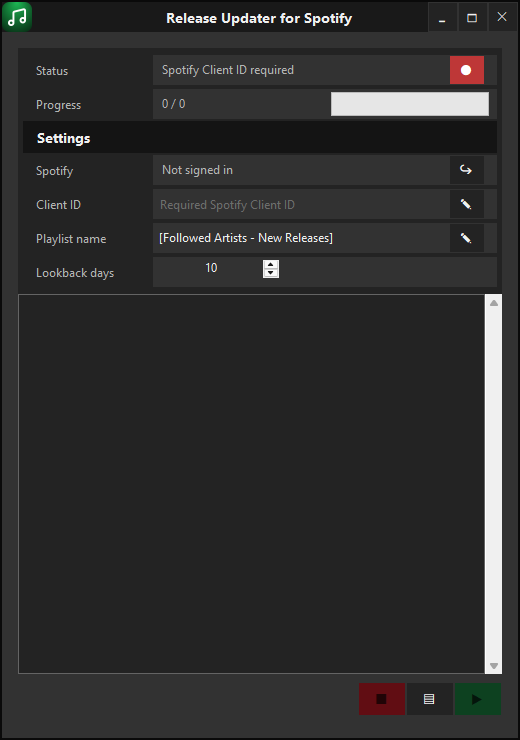

# Release Updater for Spotify

A small Windows app that keeps one Spotify playlist stocked with new releases from the artists you follow — automatically.



## What it does

- Signs in with **your own** Spotify account (no shared login, no shared app credentials — ever)
- Checks every artist you follow for new albums and singles released within a configurable lookback window (1–20 days)
- Also finds new tracks where a followed artist appears as a featured collaborator
- Deduplicates everything it finds and replaces the contents of one **private** playlist you choose
- Writes a sortable HTML report of what was added, and what got skipped as a duplicate

## Requirements

- Windows 10/11, 64-bit
- A free Spotify account — **Spotify Premium is not required.** The app only reads your followed artists and manages a playlist; it never controls playback.
- Your own Spotify Client ID (free, takes about a minute — see below)

The published build is self-contained: it bundles the .NET runtime, so there's nothing else to install.

## Getting started

1. Download the latest release from the [Releases page](../../releases) and run `Release Updater for Spotify.exe`.
2. Click the Client ID status indicator — it opens a short guide and copies the redirect URI you'll need.
3. Create a free app in the [Spotify Developer Dashboard](https://developer.spotify.com/dashboard), paste in the redirect URI, and copy the app's Client ID back into Release Updater for Spotify.
4. Sign in with your Spotify account.
5. Pick a playlist name and lookback window, then click **Update playlist**.

## Why do I need my own Client ID?

Spotify requires every app to authenticate through its own registered application. Release Updater for Spotify doesn't ship with a shared one — each user creates their own free Spotify app and connects it directly to their own account. Nothing is shared with, or sent to, anyone but Spotify itself.

## Building from source

```bash
git clone https://github.com/Erik513/ReleaseUpdaterGui.git
cd ReleaseUpdaterGui
dotnet build ReleaseUpdaterApp.sln
```

Run the tests with:

```bash
dotnet test ReleaseUpdater.Core.Tests/ReleaseUpdater.Core.Tests.csproj
```

## License

All rights reserved.
